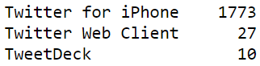

# Investigating WeRateDogs for cool insights

WeRateDogs is a Twitter account that rates people's dogs with a humorous comment about the dog. The account was started in 2015 by 
college student Matt Nelson, and has received international media attention for its popularity.

WeRateDogs asks people to send photos of their dogs, then tweets selected photos rating and a humorous comment. Dogs are rated on a scale 
of one to ten, but are invariably given ratings in excess of the maximum, such as "13/10". Popular posts are re-posted on Instagram and 
Facebook. <a href='https://en.wikipedia.org/wiki/WeRateDogs'>Wikipedia</a>

## Please check './wrangle_act.ipynb' notebook for analysis details.

## Insights After Analysis

### Insight 1: How many tweets does WeRateDogs post monthly?

On average, WeRateDogs posts 82 tweets monthly, however, starting from 2016 the number of tweets per month decreased significantly.

### Insight 2: How does WeRateDogs post their tweets?

Most of the time, WeRateDogs posts tweets using iPhone twitter app, but for rare times they use a web browser and <a href='https://en.wikipedia.org/wiki/TweetDeck'>TweetDeck</a>

### Insight 3: Average dogs rating in WeRateDogs tweets

The average rating is 10.9.

### Insight 4: Top 10 names used in WeRateDogs

Charlie is the most used name for dogs in WeRateDogs tweets

### Insight 5: Top 3 retweeted tweets

- 78,844 retweets

- 58,455 retweets

- 57,509 retweets

### Insight 6: Top 3 liked tweets

- 158,198 likes

- 134,857 likes

- 122,166 likes

### Insight 7: Number of different dogs breeds predicted from WeRateDogs photos

113 unique different breeds were predicted from WeRateDogs, where the most predicted breeds are shown below.

### Insight 8: The retweets and favorite counts average of top 10 dog breeds found in WeRateDogs 

